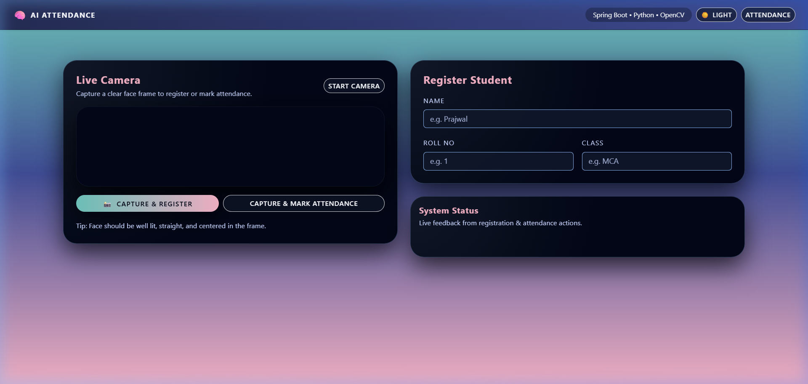
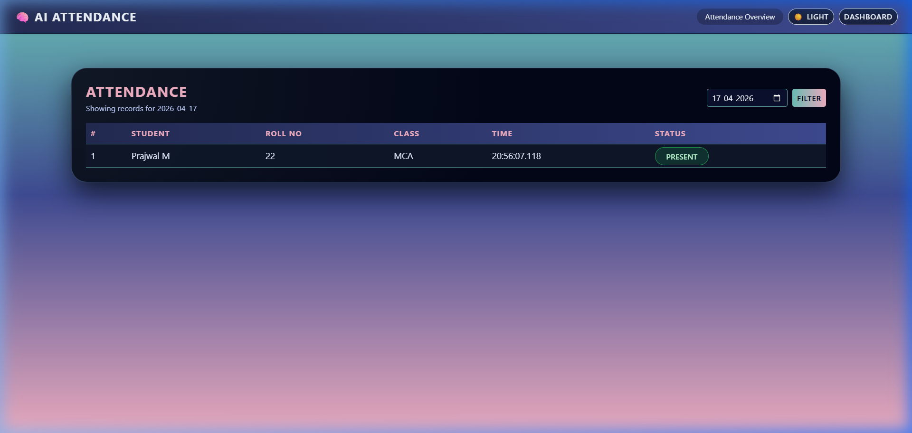
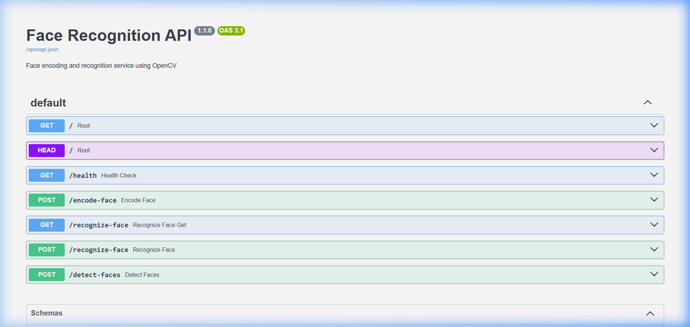

# 🤖 AI-Powered Attendance System

> **A scalable, full-stack facial recognition platform automating attendance tracking in real-time.**

## 🛑 Problem Statement
Traditional attendance systems (paper registers, swipe cards, or basic biometrics) are slow, prone to proxy (fake) attendance, and difficult to manage at scale. For large institutions and corporate offices, this results in significant time loss and inaccurate tracking records.

## 💡 Solution Overview
The **AI Attendance System** is a robust software product designed to replace manual tracking with an automated, zero-touch experience. By leveraging computer vision and a scalable microservice architecture, the system accurately detects and matches faces against registered profiles in real-time, instantly logging attendance securely in a cloud database. 

**Why this matters:** It reduces human error, guarantees data integrity by eliminating proxy attendance, and reclaims thousands of administrative hours annually.

## ✨ Core Features
- **Real-Time Facial Recognition:** Achieves high accuracy face matching using Euclidean-distance-based encoding algorithms.
- **Automated Logging:** Seamlessly identifies users and records their presence instantly into a centralized database.
- **Zero-Touch Experience:** Fully contactless, making it hygienic and frictionless for end-users.
- **Robust Persistence:** Reliable data storage supporting complex querying (e.g., date-filtered logs, student histories).
- **Scalable Architecture:** Designed with decoupled microservices (Python AI backend + Java Spring Boot API) ensuring modularity and performance under load.

## 🛠️ Tech Stack
- **AI & Computer Vision:** Python 3.11, OpenCV (Haar Cascades), NumPy
- **Backend APIs:** Java 17, Spring Boot 3.2.5, FastAPI (Python API Gateway)
- **Database:** PostgreSQL (Neon Cloud Platform), Spring Data JPA / Hibernate
- **Deployment & Architecture:** Docker, Render, RESTful Microservices

## 📐 System Architecture

### Process Flow
`Camera Input` ➔ `Face Detection (OpenCV)` ➔ `Face Recognition & Encoding` ➔ `Data Post to Backend` ➔ `Database Persistence` ➔ `Attendance Marked`

### Architecture Diagram
```text
┌────────────────────────┐      HTTP / REST      ┌────────────────────────┐
│  Java Spring Boot API  │ ◄───────────────────► │  Python AI Microservice│
│  (Data Management)     │                       │  (Face Processing)     │
└───────────┬────────────┘                       └───────────┬────────────┘
            │                                                │
      JPA / Hibernate                                   OpenCV Engine
            │                                                │
┌───────────▼────────────┐                       ┌───────────▼────────────┐
│   Cloud PostgreSQL     │                       │  Camera Feed / Image   │
└────────────────────────┘                       └────────────────────────┘
```

## ⚙️ How It Works
1. **Registration:** An administrator uploads a clear photo of the user. The Python microservice processes the image, generates a unique 10,000-dimensional mathematical encoding of the face, and stores it in PostgreSQL.
2. **Detection:** When a user walks in, the camera captures an image. OpenCV isolates the face from the background (Bounding Box Detection).
3. **Recognition:** The system compares the new face's encoding against the database using deep matching algorithms.
4. **Validation:** If the similarity score passes the configurable confidence threshold, attendance is marked `PRESENT` with a precise timestamp.

## 🚀 Installation & Setup

### Prerequisites
- Python 3.11+
- Java 17+ and Maven 3.8+
- PostgreSQL (Local or Cloud)
- Docker (Optional, for containerized run)

### 1. Launch AI Microservice
```bash
cd python-face-recognition
pip install -r requirements.txt
uvicorn app:app --host 0.0.0.0 --port 8000
```
*API docs available at `http://localhost:8000/docs`*

### 2. Configure Backend Database
Update credentials in `spring-backend/demo/src/main/resources/application.properties`:
```properties
spring.datasource.url=jdbc:postgresql://<YOUR_DB_HOST>/<YOUR_DB>
spring.datasource.username=<username>
spring.datasource.password=<password>
face.recognition.api.url=http://localhost:8000
```

### 3. Launch Spring Boot Server
```bash
cd spring-backend/demo
./mvnw spring-boot:run
```
*Application runs at `http://localhost:8080`*

## 📖 Usage Instructions
1. Navigate to the web dashboard at `http://localhost:8080`.
2. Use the **Registration Module** to onboard users by uploading their base profile pictures.
3. Use the **Attendance Module** to upload a new capture (or simulate a live feed) to verify identity.
4. Access the **Reporting Dashboard** to view logs filtered by date and individual.

## 📸 Screenshots & Demo

### 🖥️ Admin Dashboard


### 📋 Attendance Logs


### 🔌 Face Recognition API — Swagger UI


## 🔮 Future Improvements 
*Demonstrating path-to-production scalability:*
- **Real-time Video Feed Integration:** Upgrading from image-upload to live WebRTC streaming.
- **Deep Learning Upgrades:** Transitioning from OpenCV to state-of-the-art models like FaceNet or ArcFace for handling varying lighting and angles.
- **Analytics Dashboard:** Adding data visualization to track peak arrival times and overall attendance health.
- **RBAC (Role-Based Access Control):** Implementing JWT-secured admin, teacher, and student access layers.

## 👨‍💻 Author
**Prajwal**
- **GitHub:** [prajwal-m-2002](https://github.com/prajwal-m-2002)
- **LinkedIn:** [Prajwal M](https://www.linkedin.com/in/prajwalm2002/)

---
*Built with ❤️ to redefine how operational efficiency meets artificial intelligence.*
